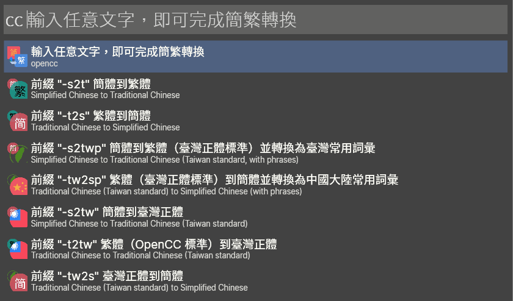

# OPENCC_wox

這是一個以 [OpenCC](https://github.com/BYVoid/OpenCC) 進行簡繁中文轉換的 [Wox](https://github.com/Wox-launcher/Wox) 外掛。

A [Wox](https://github.com/Wox-launcher/Wox) plugin that converts between Traditional Chinese and Simplified Chinese using [OpenCC](https://github.com/BYVoid/OpenCC).

## 開始使用/ Getting Started

OpenCC (開放中文轉換) 是相當知名的中文簡繁轉換開源項目。
~~[yichen0831](https://github.com/yichen0831/opencc-python) 將其改寫為純 Python程式碼~~透過官方提供的 [Python接口](https://pypi.org/project/OpenCC/)，可相當輕鬆的整合到 Wox。
OpenCC (Open Chinese Convert) is a popular opensource project for conversions between Traditional Chinese and Simplified Chinese.
An official OpenCC binding for [Python](https://pypi.org/project/OpenCC/) is available, so that this plugin could be developed with ease.

### 功能 / Features

- 關鍵詞 (`cc`) 後直接輸入目標文字，預設轉換為1)臺灣常用詞彙, 2)簡體
  

- 關鍵詞 (`cc`) 後指定轉換格式再輸入目標文字

	

- 輸入關鍵詞 (`cc`) 後上下移動焦點動以選取轉換格式。轉換格式選取完成後即可輸入目標文字。

#### 轉換格式/ Conversions

  * `s2t`: Simplified Chinese to Traditional Chinese 簡體到繁體

	

  * `t2s`: Traditional Chinese to Simplified Chinese 繁體到簡體

	

  * `s2tw`: Simplified Chinese to Traditional Chinese (Taiwan Standard) 簡體到臺灣正體

  * `tw2s`: Traditional Chinese (Taiwan Standard) to Simplified Chinese 臺灣正體到簡體

  * `s2hk`: Simplified Chinese to Traditional Chinese (Hong Kong variant) 簡體到香港繁體

  * `hk2s`: Traditional Chinese (Hong Kong variant) to Simplified Chinese 香港繁體到簡體

  * `s2twp`: Simplified Chinese to Traditional Chinese (Taiwan Standard) with Taiwanese idiom 簡體到繁體（臺灣正體標準）並轉換爲臺灣常用詞彙

  * `tw2sp`: Traditional Chinese (Taiwan Standard) to Simplified Chinese with Mainland Chinese idiom 繁體（臺灣正體標準）到簡體並轉換爲中國大陸常用詞彙

  * `t2tw`: Traditional Chinese (OpenCC Standard) to Taiwan Standard 繁體（OpenCC 標準）到臺灣正體

  * `hk2t`: Traditional Chinese (Hong Kong variant) to Traditional Chinese 香港繁體到繁體（OpenCC 標準）

  * `t2hk`: Traditional Chinese (OpenCC Standard) to Hong Kong variant 繁體（OpenCC 標準）到香港繁體

  * `t2jp`: Traditional Chinese Characters (Kyūjitai) to New Japanese Kanji (Shinjitai) 繁體（OpenCC 標準，舊字體）到日文新字體

  * `jp2t`: New Japanese Kanji (Shinjitai) to Traditional Chinese Characters (Kyūjitai) 日文新字體到繁體（OpenCC 標準，舊字體）

  * `tw2t`: Traditional Chinese (Taiwan standard) to Traditional Chinese 臺灣正體到繁體（OpenCC 標準）

### 安裝/ Installing

1. 需先安裝 Python 模組 ~~`opencc-python`~~ `opencc`

	You need to have the Python library[~~`opencc-python`~~ `opencc`](https://pypi.org/project/OpenCC/) installed first.
> ~~`pip install opencc-python-reimplemented`~~
> `pip install OpenCC`
2. 將此資料夾存放在 ..\AppData\Roaming\Wox\Plugins\ 下即可使用

	Copy this folder to ..\AppData\Roaming\Wox\Plugins\

## Credits

[yichen0831](https://github.com/yichen0831/opencc-python) for [opencc-python](https://github.com/yichen0831/opencc-python).

[BYVoid](https://github.com/BYVoid/OpenCC) for [OpenCC](https://github.com/BYVoid/OpenCC).

